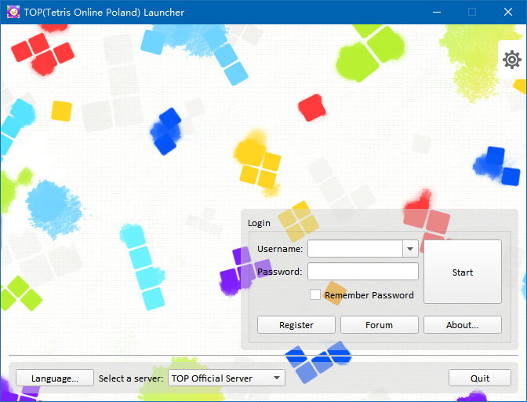

# TOPLauncher
A launcher program for an online game stopped the service a long time ago - Tetris Online.

## Introduction

Apart from letting the client connect to a custom server then launch the game, this launcher executable aims to provide some "exciting"(?) features:
- Private server list storing and management.
- Remembering accounts logging to a server.
- Customizing the game's internal settings.
- GUIs for modding archives within the client.
- A slightly better looking.

Here is what the launcher looks like:

## Usage

Since files included in a released version contain only one standalone executable, what you need to do is just copy the executable to the Tetris Online client's directory. The launcher will automatically detect the existence of the client executable. As the executable is detected, You will be able to launch the client connecting a custom server via a registered account. 

## Building

See [BUILDING.md](BUILDING.md).

## Special Thanks

- rainkitsune@Twitter & Teatube222@Twitter: for Japanese translations.
- Wojtek: for previous works modding the Tetris Online client.
